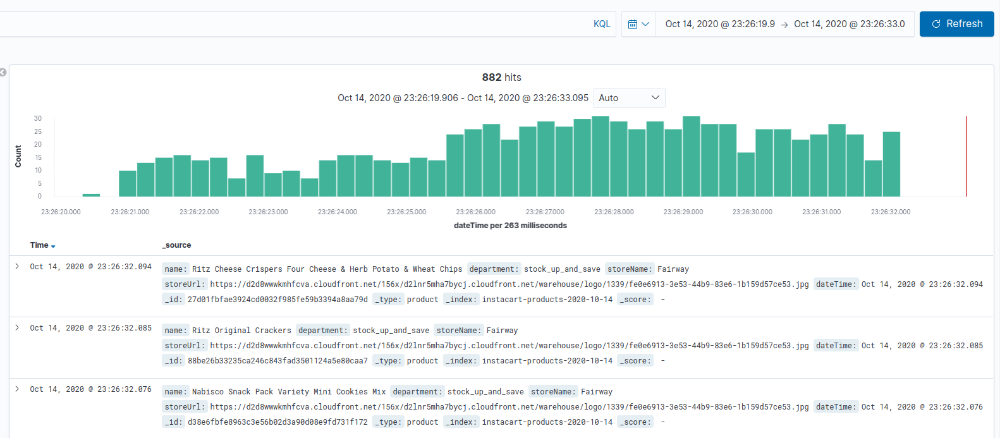

# Instacart Crawl

A spider from [Instacart!](https://www.instacart.com/)

The spider capture the products of the first store in the account.

To broken the Recaptcha has used the [2Captcha ](https://2captcha.com/) system, 
so it's necessary to set the API KEY as environment vars.


 
### Environment vars

First of all, create `.env` file in the root of the project and set all environment vars. 
See the `.env-example` file

1 - Auth credentials of Instacart Site

````.env
AUTH_USER=
AUTH_PASSWORD=
````

2 - The 2Captcha API KEY

````.env
2CAPTCHA_API_KEY=
2CAPTCHA_URL=https://2captcha.com/in.php
````

3 - Save products on DB (ElasticSearch)

````.env
SAVE_DB_ITEM=True
````

### Pre Run

Create a virtualenv and install dependencies: ```make setup``` 

### Running

To run, use:

````python
make run
````

To run using docker, you can use:

````python
make run-docker
````

Your server is running: http://0.0.0.0:8080

### Instacart Spider

Just access: http://0.0.0.0:8080/instacart

#### Steps of the spider

```
1 - Get the access token
2 - Login using 2captcha service
3 - Create a task to extract the products asynchronously
4 - Save the result in the "instacart_items.json" file
5 - Save all products on ElasticSearch (if the flag SAVE_DB_ITEM is True)
```

#### Kibana

If you set `SAVE_DB_ITEM=True` and executed `make run-docker` you can see all products on Kibana here: http://localhost:5601/

## Tools used

    - Python 3.7
    - 2Captcha (To broken recaptcha)
    - AIOHTTP (To create a server and making async requests)
    - ElasticSearch (To save and indexing all products)

## The Process

While the process I've used the Pomodoro methodology. I took breaks of 5 minutes and hands-on of 30min. Was important it because some times
I wasn't redeeming anymore as in the beginning. So, theses break moments make me more relaxing to start again.

In the beginning, I had a limitation because the Instacart Store isn't in my region. So, I had to find a postcode from the USA. I got a postcode code from New York and made the signup with it and my personal email.

The postcode used: 10040

#### Best Practices

I always tried to use clean code and architecture best practices.
So, you will see here an organization based on limits, resources, business, and also:

- Clean Names
- Code Delimitations
- Unique Responsibilities


## The Challenges

My first difficult was to get the access_token. I needed it to build a login request. After some minutes of searching, I found it and merging
with the captcha token has taken through the 2Captcha system, was possible to gain a instacart session.

After that, I took some hours to discover how to get the data. It was a litter difficult because the site has API navigation
and uses javascript to load the data on the page. So, I needed to understand the API flow, but I got it!

## TODO

```
1 - Create a Dashboard where is possible to see the processing of scraping in real-time
2 - Unit Tests
3 - Treat all exceptions
```

